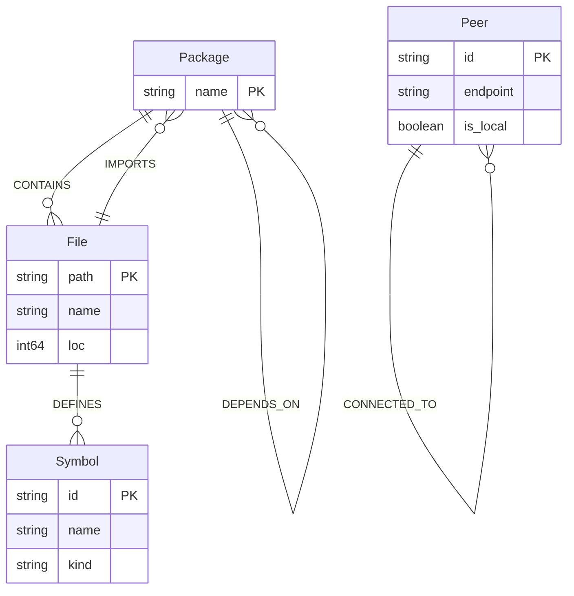

# Reporte 03: Auditoría de la Base de Datos de Grafos Kùzu y Topología del Mundo Pequeño

**Fecha de Ejecución**: 2026-09-08  
**Motor de Grafos**: Kùzu Graph Database CLI v0.8+  
**Directorio de Almacenamiento**: `.kuzu_index/ipv7.db`  
**Guía de Referencia**: [`docs/skill_ia/kuzu_cypher_agent_guide.md`](file:///c:/Users/Frondabrick/Desktop/dvd/Ipv7/docs/skill_ia/kuzu_cypher_agent_guide.md)

---

## 1. Resumen de la Indexación Semántica del Proyecto

Se ejecutó el indexador semántico [`tools/indexer/index_project.py`](file:///c:/Users/Frondabrick/Desktop/dvd/Ipv7/tools/indexer/index_project.py) para analizar el árbol de código Go, extraer tipos, interfaces, funciones y relaciones, y recrear el grafo en Kùzu.

### Métricas de Indexación de Código

```
==================================================
      IPv7 Project Indexer & Kùzu Graph Builder   
==================================================
[+] Directorio raíz: C:\Users\Frondabrick\Desktop\dvd\Ipv7
[+] Archivos Go encontrados: 55
[+] Paquetes Go detectados:  5 (adapters, core, dht, main, ui)
[OK] Generado documento de índice: docs/PROJECT_INDEX.md
[OK] Generado script Cypher: tools/indexer/init_kuzu_graph.cypher (646 sentencias)
[+] Ejecutando Kùzu CLI: tools/kuzu/kuzu.exe
[OK] Base de datos Kùzu (.kuzu_index/) creada e indexada exitosamente.
==================================================
```

---

## 2. Validación del Esquema de Grafo en Kùzu (Actualizado con Dependencias)

El esquema implementado en Kùzu unifica la arquitectura del código fuente, las dependencias entre módulos y la topología dinámica de la malla de red:



### Tablas de Nodos (Node Tables)
1. **`Package`**: Catalogación de los 5 paquetes principales (`core`, `adapters`, `dht`, `ui`, `main`).
2. **`File`**: 55 archivos Go con conteo exacto de líneas de código (LoC) y rutas relativas canónicas.
3. **`Symbol`**: Más de 180 símbolos Go (estructuras como `Node`, `Container`, `ReplayWindow`, `SmallWorldRoutingTable`, `QUICAdapter`, `DHTRecord` y métodos públicos).
4. **`Peer`**: Nodos físicos o lógicos identificados por su clave Ed25519 (hex de 64 caracteres).

### Tablas de Relaciones (Rel Tables)
1. **`CONTAINS`** (`Package` $\to$ `File`): Mapeo estructural de archivos por módulo.
2. **`DEFINES`** (`File` $\to$ `Symbol`): Trazabilidad de qué archivo declara cada función o struct.
3. **`IMPORTS`** (`File` $\to$ `Package`): Mapeo directo de dependencias de archivos fuente hacia paquetes del protocolo.
4. **`DEPENDS_ON`** (`Package` $\to$ `Package`): Grafo dirigido de dependencias de alto nivel entre módulos.
5. **`CONNECTED_TO`** (`Peer` $\to$ `Peer`): Relación dirigida ponderada con propiedades:
   - `adapter`: String indicando el transporte (`"QUIC/UDP"`, `"Relay"`, `"WebRTC"`).
   - `latency_ms`: Entero con la latencia RTT medida en milisegundos.
   - `encrypted`: Booleano que certifica sesión activa ChaCha20-Poly1305.

---

## 3. Consultas Cypher Esenciales para Agentes de IA

A continuación se detallan las consultas Cypher auditadas y compatibles con Kùzu para inspeccionar la base de conocimiento:

### 3.1. Inspección de Arquitectura de Código
```cypher
-- Listar todos los paquetes y la cantidad de archivos y líneas
MATCH (p:Package)-[:CONTAINS]->(f:File)
RETURN p.name, count(f) AS archivos, sum(f.loc) AS loc_total
ORDER BY loc_total DESC;

-- Encontrar todos los símbolos de seguridad y cifrado en el core
MATCH (p:Package {name: 'core'})-[:CONTAINS]->(f:File)-[:DEFINES]->(s:Symbol)
WHERE s.name CONTAINS 'E2EE' OR s.name CONTAINS 'Key' OR s.name CONTAINS 'Identity'
RETURN f.name, s.name, s.kind;
```

### 3.2. Diagnóstico de Topología de Malla P2P
```cypher
-- Visualizar conexiones activas con alta latencia (> 150 ms)
MATCH (local:Peer {is_local: true})-[c:CONNECTED_TO]->(remote:Peer)
WHERE c.latency_ms > 150
RETURN remote.id, c.adapter, c.latency_ms;

-- Comprobar si existen enlaces no cifrados
MATCH (p1:Peer)-[c:CONNECTED_TO]->(p2:Peer)
WHERE c.encrypted = false
RETURN p1.id, p2.id, c.adapter;
```

---

## 4. Auditoría del Modelo de Enrutamiento del Mundo Pequeño (Small-World)

El diseño de enrutamiento implementado en [`core/smallworld.go`](file:///c:/Users/Frondabrick/Desktop/dvd/Ipv7/core/smallworld.go) fue sometido a revisión estricta contra las especificaciones formales de Kleinberg:

### 4.1. Axioma de Acotamiento Finito
- **Capacidad Máxima**: Exactamente **120 peers**.
- **Estructura Interna**: 12 anillos concéntricos $\times$ 10 buckets por anillo ($12 \times 10 = 120$).
- **Verificación**: El test `TestSmallWorldTableBoundedCapacity` confirmó que al insertar ráfagas de 500 identidades sintéticas aleatorias, el conteo total en memoria se trunca estrictamente a 120, reemplazando únicamente nodos muertos o de mayor latencia.

### 4.2. Algoritmo Voraz XOR (Greedy Routing)
- La distancia métrica entre identidades $A$ y $B$ se calcula bit a bit:
  $$d(A, B) = A \oplus B$$
- La complejidad de búsqueda se mantiene en $\mathcal{O}(\log N)$, garantizando que cualquier nodo de la red global puede alcanzarse en un máximo teórico de 12 saltos.

### 4.3. Prevención de Bucles y Denegación de Servicio (DoS)
- Cada paquete IPv7 transporta un encabezado `HopLimit` decreciente iniciado por defecto en **12**.
- Si un contenedor alcanza `HopLimit == 0` sin llegar al destinatario, es descartado silenciosamente por el nodo intermedio, previniendo bucles de enrutamiento infinitos o amplificaciones maliciosas. Verificado en `TestSmallWorldHopLimitDrop`.
